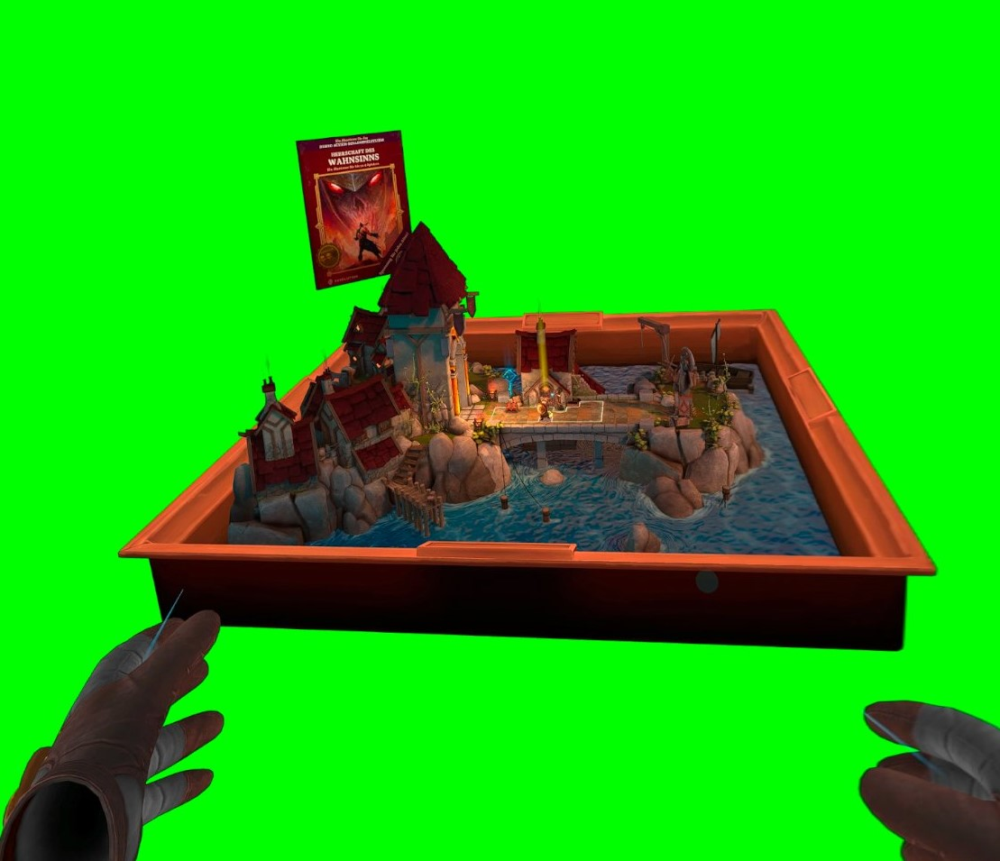
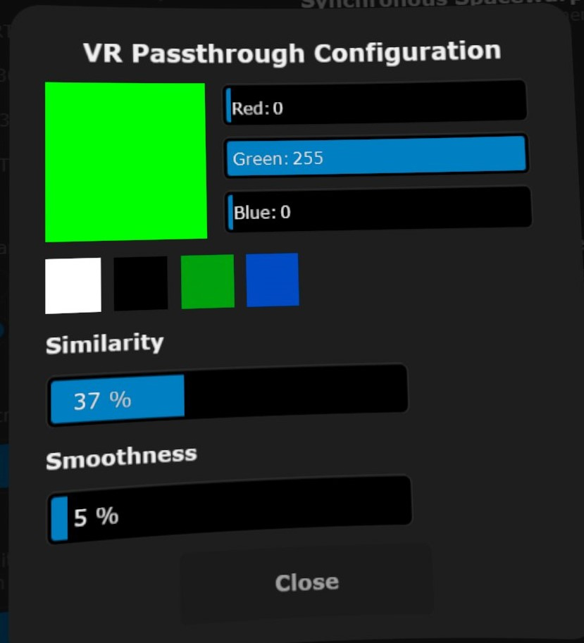

# Demeo_GreenScreen
Replaces the black background color with green, enabling mixed reality in the PCVR version of the game through [VirtualDesktop](https://www.meta.com/de-de/experiences/1261331807302580/)'s passthrough mode.

  

## How To Install & Use

* Download [MelonLoader](https://github.com/LavaGang/MelonLoader/releases) **version 0.5.7**, open the downloaded Installer and Select the Game's .exe `Demeo\Demeo.exe`. Press `Install`.
* Download the zip from [here](https://github.com/McFredward/Demeo_GreenScreen/releases) and unzip the file into `Demeo\Mods`.
* Start the game & turn off the basement environment in the setting ingame.
* Turn on "VR Passthorugh" under the "Streaming"-Tab in the Virtual Desktop Menu (within VR).
* **USE THE FOLLOWING CONFIGURATION:**:

Red: 0, Green: 255, Blue: 0, Similarity: 37, Smoothness: 5

  

I deliberately opted for a different shade of green than the one provided in VirtualDesktop, as I realized through various tests that the full green tone works better in Demeo. 
Many of the green hues in the game are too similar to the default one.

## Known issues

* Green edges around the objects (Depends on your passthrough configuration in Virtual Desktop, the given one is just which I found best)
* You can look through some parts of some objects which also have the same green color like the Swiftness Potion Card.

## Credits & Libs

* Code inspired by "SkipIntro" from [DemeoMods by orendain](https://github.com/orendain/DemeoMods) using the MIT License
* [HarmonyLib](https://github.com/pardeike/Harmony) using the MIT License
* [MelonLoader](https://github.com/LavaGang/MelonLoader) using the Apache-2.0 license

If you have any suggestions, feel free to open an Issue. Or contact me (McFredward) in via Discord.

